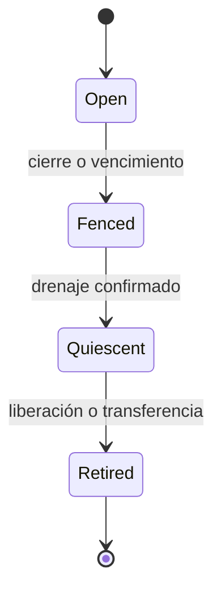

# Ejecución y vida del trabajo

## Tres identidades que no se sustituyen

Una tarea de Thalyx puede abrir un ámbito para explorar, otro para validar y otro para publicar. Un ámbito puede ejecutar hilos propios y recibir trabajo delegado a servidores residentes. Una transacción puede vivir más que un proceso y debe sobrevivir a la pérdida de una respuesta. El kernel solo interpreta el ámbito y las ejecuciones locales.

Un dominio tiene un ámbito propietario que paga su infraestructura. Un hilo tiene un contexto efectivo que paga trabajo corriente. Al atender IPC, un worker presta ejecución al ámbito de origen sin cambiar de espacio de direcciones ni recibir automáticamente los permisos del cliente. Los permisos recibidos se transfieren explícitamente.

## Máquina de estados del ámbito

Las transiciones son monotónicas. Un ámbito no se reabre: reintentar crea otro identificador. Cerrar el padre impide nuevas admisiones de los hijos, incluso antes de recorrerlos físicamente. El recorrido libera y notifica después.

`Quiescent` significa que el kernel ya no observa hilos ejecutando ese trabajo, mapas pendientes de revocación, invocaciones retenidas ni DMA asignado a ese cierre. Para trabajo de servidor incluye sus respuestas/recibos de resolución; se confía en el contrato del servicio correspondiente. No demuestra que un remoto haya olvidado una petición ni que se hayan revertido efectos históricos.

El informe de drenaje expone contadores por clase, último progreso, servicios pendientes, bytes retenidos y resultados externos desconocidos. Un resultado externo desconocido puede coexistir con quiescencia local una vez que no hay más trabajo local pendiente; se conserva la incertidumbre semántica.

## Construcción y muerte de dominios

Un dominio pasa por `Building → Runnable → Faulted/Stopping → Dead`. La transición a ejecutable requiere maps válidos, stack, tablas de capacidades, ámbito abierto y canal de fallo. Una excepción de usuario se entrega como mensaje acotado al supervisor; no se invoca código del supervisor dentro del kernel.

Terminar el dominio elimina sus hilos y accesos directos, pero no borra tickets ni cargos retenidos por servidores. Un kernel puede reconocer que murió el emisor y cancelar mensajes aún no recibidos; una petición recibida ya es una obligación del receptor. La supervisión no mata automáticamente un servidor compartido para cerrar un cliente.

El supervisor decide reiniciar servicios con una nueva época de sesión. Los clientes detectan endpoints muertos y reconectan mediante capacidades nuevas; no hay resurrección silenciosa de handles a un objeto distinto.

## Modelo de trabajo recomendado para Thalyx

| Actividad | Vida elegida |
|---|---|
| Motor y pesos residentes | Dominio y ámbito de servicio duradero; pesos inmutables patrocinados por ese servicio. |
| Inferencia | Invocación con ámbito, buffers y cuota de la tarea; se limpia antes de reutilizar buffers entre clientes. |
| Compilador/herramienta ajena | Dominio dedicado por trabajo o pool con reinicialización comprobada; entradas de solo lectura y salida privada. |
| Programa de operaciones | Runtime de usuario; autoridad explícita en cada hostcall, límite del runtime y límite del ámbito. |
| Validación | Trabajo separado que identifica versión, herramienta, configuración y cobertura. |
| Publicación | Solicitud específica con derecho distinto del derecho de escribir el workspace privado. |

Compartir un proceso entre tareas no es compartir una frontera de seguridad. Si se requiere confidencialidad frente a un motor o runtime malicioso, hace falta separar dominios; los tickets solo atribuyen trabajo, no aíslan buffers.

## Cancelación operativa

Cancelar establece barrera, despierta esperas cancelables, impide nuevos hijos y retira mensajes no entregados. Se detienen hilos propios; servidores reciben señal de cierre. Los buffers no se reutilizan hasta resolver accesos de CPU y dispositivo. La recuperación usa recursos reservados.

Las tareas pueden solicitar un tiempo de cierre, pero vencer ese tiempo produce una notificación de incumplimiento y estado pendiente. No se considera una garantía de tiempo real. Un dispositivo bloqueado puede obligar a resetear su grupo, retener RAM o reiniciar el sistema; el informe debe nombrarlo.

Un supervisor puede aumentar límites de un ámbito abierto dentro de su autoridad. No puede reactivar uno cerrado ni borrar su deuda para eludir un límite. La respuesta a un presupuesto insuficiente es explícita: pausar hasta reposición de CPU, rechazar admisión o terminar según la clase de recurso.
