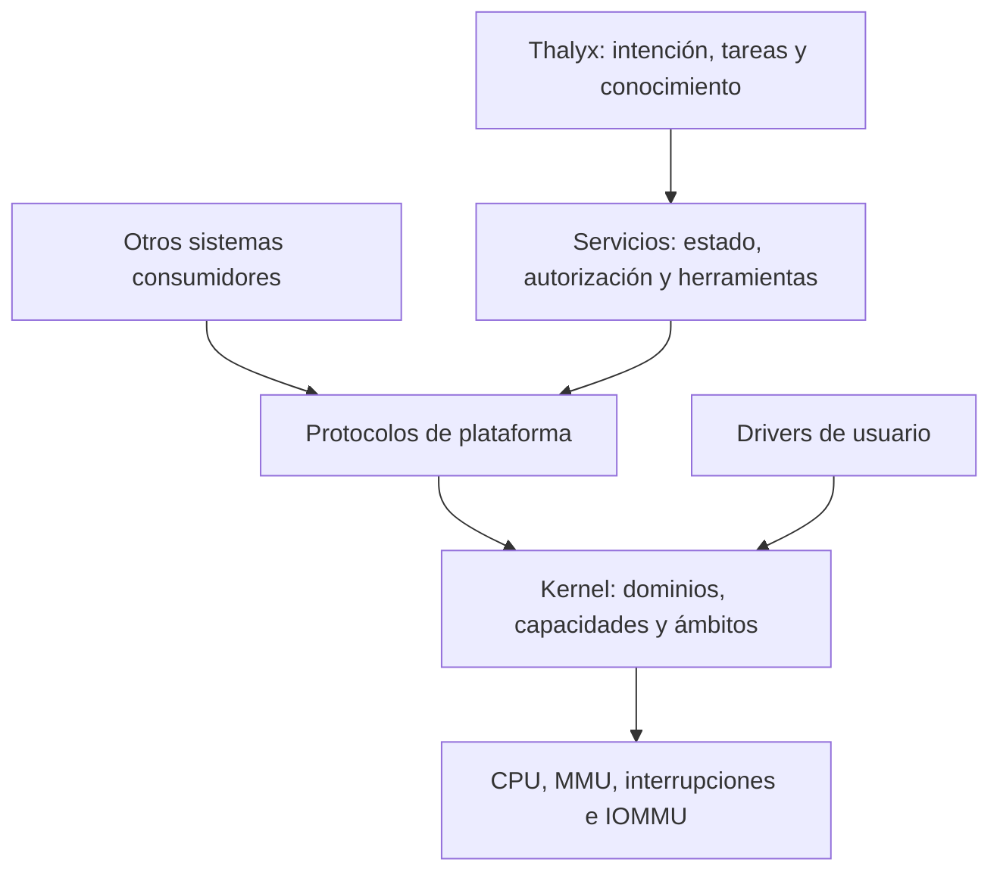

# Derivación y arquitectura

## De necesidades a mecanismos

La derivación parte de cuatro observaciones de Thalyx: el trabajo cruza procesos; un permiso depende de objeto y vida; una validación depende de entradas; un resultado puede publicarse después de una ejecución especulativa. [E04–E15](../evidence/thalyx.md) muestran consecuencias concretas de perder esos vínculos.

1. Para ejecutar código no confiable se necesita una frontera que no dependa de su buena conducta: dominios de memoria protegidos.
2. Para delegar una operación sin entregar toda una identidad global se necesita una referencia controlada a un objeto: capacidades.
3. Para cancelar y cobrar trabajo que atraviesa esos dominios se necesita una identidad independiente del proceso: ámbitos e invocaciones.
4. Para validar resultados se necesitan entradas identificables: objetos inmutables y versiones administradas.
5. Para publicar una conclusión sobre esas entradas se necesita una decisión serializada de estado y política: un servicio transaccional.
6. Para que otro sistema consumidor use lo anterior, el kernel debe ignorar el significado de tareas, modelos y conocimiento.

Los tres primeros puntos requieren arbitraje del kernel. El cuarto usa protección de memoria del kernel, pero su estructura persistente pertenece a usuario. El quinto no requiere que el kernel interprete archivos, módulos o intenciones.

## Fronteras elegidas

El servicio de estado y los drivers son procesos separados, no bibliotecas del kernel. Los protocolos de plataforma especifican resultados y errores comunes; Thalyx conserva su superficie propia. El servidor de autorización emite delegaciones a partir de reglas del consumidor. El kernel comprueba su estructura y vida, no la validez moral de la regla.

## Núcleo mínimo con responsabilidades completas

El kernel contiene creación y destrucción de dominios, hilos y objetos; tablas de capacidades; páginas y mapas; excepciones; planificación preemptiva y cobro; IPC acotado; ámbitos, barreras y seguimiento de invocaciones; interrupciones, temporizadores, aislamiento DMA y evidencias de control limitadas.

No contiene filesystem, cargador general de paquetes, red TCP/IP, SQLite, modelo de IA, compilador, grafo de conocimiento, política de consentimiento ni un motor transaccional persistente. El cargador ELF inicial de usuario se ejecuta en el supervisor; el loader de arranque solo carga el kernel y el paquete inicial.

Una operación de datos grande utiliza memoria compartida **inmutable** o propiedad exclusiva transferida mediante protocolo; una operación de control usa IPC copiado pequeño. No se exige zero-copy en todas las rutas. Una copia que elimina alias y simplifica vida puede ser la opción inicial correcta.

## Servicios iniciales

| Servicio | Autoridad mínima | Fallo contenido y consecuencia |
|---|---|---|
| Supervisor y recuperación | Crear dominios/ámbitos, gestionar recursos delegados y detener hijos. | Su caída exige recuperación superior o reinicio; forma parte del TCB de disponibilidad. |
| Autorización y canal humano | Delegar capacidades dentro de su raíz, administrar políticas persistentes. | Puede conceder mal dentro de su autoridad; no se confía en texto del agente para aprobar. |
| Estado administrado | Gestionar objetos persistentes y raíz publicada; acceso a su dispositivo mediante broker. | Su corrupción amenaza integridad del estado, aunque no autoriza escribir memoria del kernel. |
| Driver de bloque | Colas e interrupciones del dispositivo asignado; buffers DMA acotados. | Puede corromper/omitir datos del dispositivo; reinicio requiere recuperación y nueva época de sesión. |
| Servicios de herramientas | Entradas concretas, workspace privado y recursos de la petición. | Caída cancela esa herramienta; no publica por sí sola una raíz global. |
| Motor de inferencia | Pesos de solo lectura y buffers por solicitud, sin autoridad ambiental sobre estado o red. | Su salida es dato no confiable; residentes y peticiones tienen presupuestos separados. |

## Qué compra y qué cuesta esta elección

Compra puntos de admisión explícitos y aislamiento de fallos de memoria entre servicios. Impone IPC, cambios de contexto, diseño de protocolos, recuperación de servidores y portabilidad. Tener capacidades no elimina un confused deputy: un servidor que tiene permiso de publicar puede hacerlo mal. Por eso el contrato de servicio y su TCB son explícitos.

Un monolito nuevo también podría proporcionar ámbitos y capacidades. Se descarta inicialmente porque mezclar parsers de almacenamiento, drivers y política con la protección de toda memoria aumenta el radio de un fallo sin aportar una necesidad demostrada de Thalyx. Una arquitectura de un único espacio Rust se descarta como frontera general porque el consumidor ejecuta herramientas nativas y dependencias ajenas.

No se adopta seL4 como base porque el proyecto se construye desde cero y busca investigar este contrato concreto. Sus mecanismos y pruebas son evidencia para escoger y limitar mecanismos; no una certificación de este diseño. [Alternativas](../research/alternatives.md) y [ADR-001](../decisions/ADR-001-kernel-boundary.md) conservan el razonamiento rival.

## Recorrido vertical de referencia

Thalyx abre una tarea sobre una versión; autorización delega capacidades; supervisor crea un ámbito hijo con límites; herramientas ejecutan en dominios y sirven resultados vinculados a esa versión; el estado permanece privado; validación produce un recibo con cobertura; una capacidad separada permite solicitar publicación contra la generación esperada. El servicio de estado valida política, registra una decisión durable y cambia la raíz visible. Thalyx puede explicar el resultado consultando el mismo recibo.

Si se cancela antes de publicar, se cierra trabajo y se descarta estado privado. Si una publicación ya se admitió, puede concluir bajo el protocolo de cierre. Si su respuesta se pierde, se consulta por identidad de petición. Si hubo un envío externo, su resultado se declara por separado. El [contrato de persistencia](persistence.md) evita convertir esta secuencia en una transacción universal ficticia.
